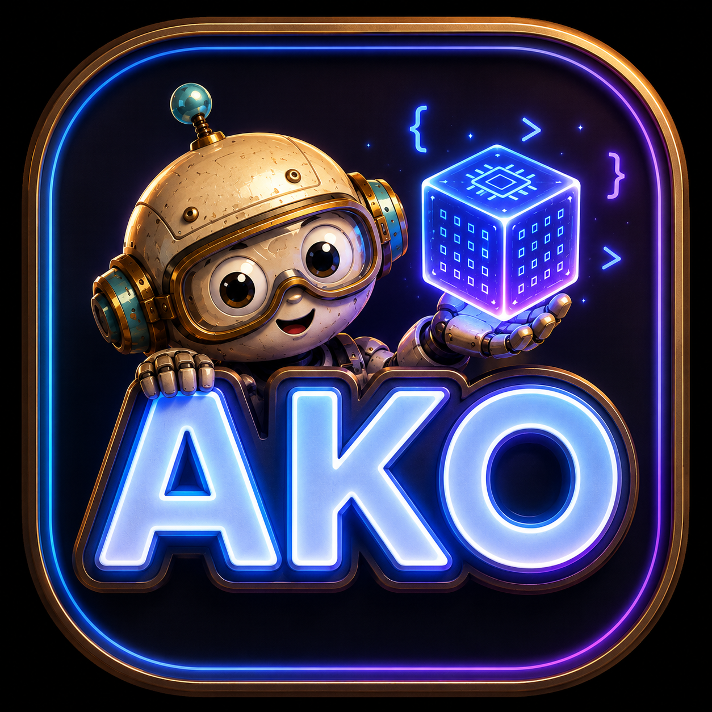

<p align="center">
  
</p>

<p align="center"><b>Agentic Kernel Optimization</b></p>

<p align="center">
  <a href="https://tongminglaic.github.io/AKO"></a>
  <a href="https://github.com/TongmingLAIC/AKO4ALL"></a>
  <a href="https://github.com/TongmingLAIC/AKO4X"></a>
  <a href="https://tongminglaic.github.io/AKO/assets/ako-tech-report.pdf"></a>
</p>

<p align="center"><b>If you find our work useful, please consider giving us a star 🌟</b></p>

Achieve competitive GPU kernel performance in just hours.

**[Visit the project homepage →](https://tongminglaic.github.io/AKO)**

## Highlights

- **[AKO4X](https://github.com/TongmingLAIC/AKO4X)** beats the FlashInfer **expert** on **9 of the 10** operator families profiled on NVIDIA B200 — up to **30.71×** on DSA sparse attention, from the [MLSys-2026](https://mlsys26.flashinfer.ai/) FlashInfer-Bench contest set.
- **[AKO4ALL](https://github.com/TongmingLAIC/AKO4ALL)**, the drop-in skill, beats the expert on all 4 inference operators — one prompt, **~1h** per kernel.

**[Full results on the project page →](https://tongminglaic.github.io/AKO#results)**

## News

- 📄 **[2026.05.31]** The **[AKO tech report](https://tongminglaic.github.io/AKO/assets/ako-tech-report.pdf)** is now available.
- 🚀 **[2026.05.31]** [**AKO4X**](https://github.com/TongmingLAIC/AKO4X) is now open-source — the closed-loop, campaign-based system behind our [MLSys 2026 competition](https://mlsys26.flashinfer.ai/) entry.
- ✨ **[2026.05.31]** [**AKO4ALL**](https://github.com/TongmingLAIC/AKO4ALL) is now a single drop-in [Claude Code](https://docs.anthropic.com/en/docs/claude-code) skill — invoke it in any working directory.
- 🚀 **[2026.03.24]** [AKO4ALL](https://github.com/TongmingLAIC/AKO4ALL) is released. Check out the [project page](https://tongminglaic.github.io/AKO).

## Overview

AKO is **not** a new agent or model — it is a **harness** (optimization environment) for existing coding agents such as [Claude Code](https://docs.anthropic.com/en/docs/claude-code). It places the agent into a well-structured environment where the evaluation criteria, benchmarking tools, profiling interfaces, and optimization trajectory are all clearly defined and readily accessible.

## Tools

| Tool | Description | Repo |
|------|-------------|------|
| **AKO4ALL** | Single drop-in [Claude Code](https://docs.anthropic.com/en/docs/claude-code) skill — open and minimal, for any kernel and any language. Bring your own benchmark or use the built-in [KernelBench](https://github.com/ScalingIntelligence/KernelBench) evaluator. | [TongmingLAIC/AKO4ALL](https://github.com/TongmingLAIC/AKO4ALL) |
| **AKO4X** | Advanced, eXtensible harness: single manual sessions or closed-loop multi-round campaigns with cross-run memory, master/sub agent separation, and opt-in harness co-evolution. Benchmark-swappable via a thin adapter (default [flashinfer-bench](https://github.com/flashinfer-ai/flashinfer-bench)). | [TongmingLAIC/AKO4X](https://github.com/TongmingLAIC/AKO4X) |

## Tech Report

The **[AKO tech report](https://tongminglaic.github.io/AKO/assets/ako-tech-report.pdf)** is now available.

## Acknowledgments

We would like to thank the following open-source projects that inspired and supported the development of AKO:

- [KernelBench](https://github.com/ScalingIntelligence/KernelBench) — for the benchmark and evaluation format used by AKO4ALL's built-in evaluator.
- [FlashInfer](https://flashinfer.ai/) — for the LLM inference kernel library and the [flashinfer-bench](https://github.com/flashinfer-ai/flashinfer-bench) benchmark infrastructure on which AKO4X is built.
- [autoresearch](https://github.com/karpathy/autoresearch) and [autokernel](https://github.com/RightNow-AI/autokernel) — AKO's design was inspired by their work on autonomous optimization loops.

We also thank [Modal](https://modal.com/) for the GPU credits that powered our [MLSys 2026 competition](https://mlsys26.flashinfer.ai/) runs.

## Citation

If you find AKO useful, please cite:

```bibtex
@misc{ako2026,
  title        = {{AKO}: Agentic Kernel Optimization},
  author       = {Shuxiao Xie and Shuyang Xie and Dezhi Ran and Wei Yang and Tao Xie},
  year         = {2026},
  howpublished = {\url{https://tongminglaic.github.io/AKO}},
  note         = {Technical report}
}
```
